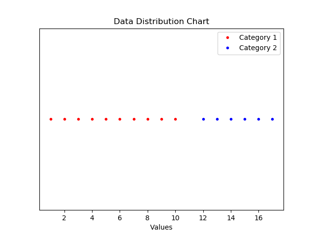
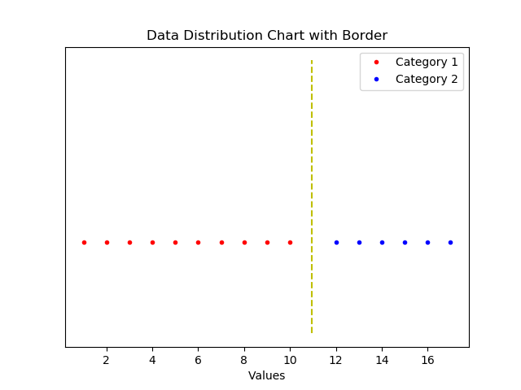
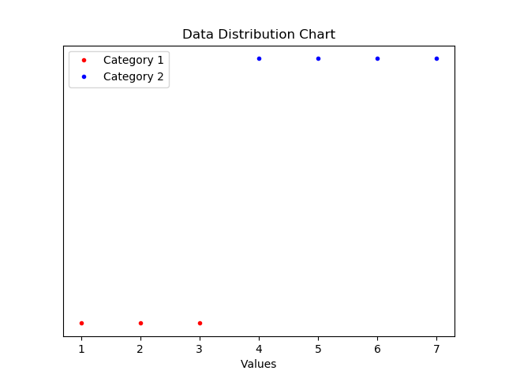
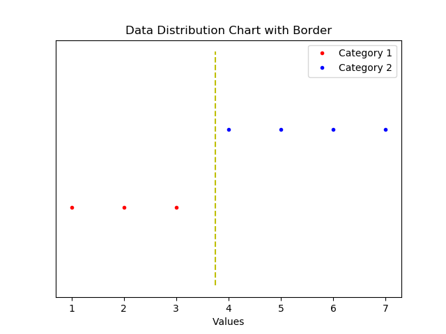
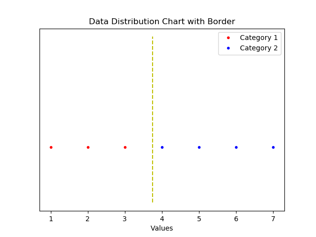

# ba2cc

## Introduction
**ba2cc** is a python-powered algorithm module for finding a border between two sorts of data which distributes in some range developed by Stephen Oh. It's short for '**B**orderline **A**lgorithm for **Two** **C**ategories with **C**ontinuous Data'.

## License
This module is deployed under the MIT License.

## Contact
For Helping or Trouble-Shooting, Please report them on Issues with Labels. ```question``` tag for Helping, ```Bug``` for reporting bugs.

## Pre-setup
This module requires NumPy and matplotlib for operation, please make sure that you've
installed them to your python's default directory.

You can install them by pip, with following commands in your cmd:
```
pip install numpy
pip install matplotlib
```

## Installization
You can use this module simply by downloading, and locating code file(ba2cc.py) to your project directory, and importing this module(ba2cc) in your code.

## Documentation

### Structure of Module
```
MODULE ba2cc
|_ CLASS BAManager
|_ CLASS ExtremeManager
|_ CLASS DataManager
|_ CLASS FileManager
|_ VARIABLE DEBUG
```
ba2cc Module has consisted of a total of four classes and one variable for debugging.
Class BAManager is the main class for this module, which for calculating and displaying border value between two categories of continuously-distributed data.
Class ExtremeManager is for excluding extreme values within sets by offset, which directly used at deleting too-far data from other ones.
Class DataManager is for sorting values ascending or descending.
Class FileManager is for opening, loading, closing CSV(Comma-Separated-Values) File to read data from the file.

### Class - BAManager
#### Structure
```
CLASS BAManager
|_ CONST OPTION_UNLAYERED
|_ CONST OPTION_LAYERED
|_ BAManager(category1_data_in_list, category2_data_in_list)
|_ FUNCTION getData()
|_ FUNCTION setStep(step)
|_ FUNCTION getStep()
|_ FUNCTION setCategoryData(category_number, data_in_list)
|_ FUNCTION getCategoryData(category_number)
|_ FUNCTION setCategoryName(category_number, name)
|_ FUNCTION getCategoryName(category_number)
|_ FUNCTION calculateSignedBorder()
|_ FUNCTION calculateUnsignedBorder()
|_ FUNCTION calculateEntropyBorder()
|_ FUNCTION calculateSignedMeanBorder()
|_ FUNCTION calculateUnsignedMeanBorder()
|_ FUNCTION displayDataInChart(display_mode)
|_ FUNCTION displayBorderInChart(display_mode)
|_ FUNCTION setCategoryDataMin(category_number)
|_ FUNCTION getCategoryDataMin(category_number)
|_ FUNCTION setCategoryDataMax(category_number)
|_ FUNCTION getCategoryDataMax(category_number)
|_ FUNCTION calculateSignedCost(border, data_in_list)
|_ FUNCTION calculateUnsignedCost(border, data_in_list)
|_ FUNCTION calculateSignedCostMean(border, data_in_list)
|_ FUNCTION calculateUnsignedCostMean(border, data_in_list)
|_ FUNCTION calculateEntropy(category1_data_in_list_inArea, category2_data_in_list_inArea)
|_ FUNCTION calculateDividedEntropy(category1_data_in_list, category2_data_in_list, border)
```

#### Const Variables
##### CONST OPTION_UNLAYERED
Const Variable OPTION_UNLAYERED is used for setting displaying mode when you uses ```displayDataInChart(display_mode)``` or ```displayBorderInChart(desplay_mode)```. With OPTION_UNLAYERED mode, The Data Distribution Chart will be unlayered, which means data of two categories will be displayed in same y-value like this:



##### CONST OPTION_LAYERED
Const Variable OPTION_LAYERED is used for setting displaying mode when you uses ```displayDataInChart(display_mode)``` or ```displayBorderInChart(desplay_mode)```. With OPTION_LAYERED mode, The Data Distribution Chart will be layered, which means data of two categories will be displayed in different y-value like this:


#### Constructor

###### CONSTRUCTOR BAManager(category1_data_in_list, category2_data_in_list)
Constructor of Class BAManager requires two perameters ```category1_data_in_list``` and ```category2_data_in_list```. Parameter ```category1_data_in_list``` is a list object that you'll gonna save to category 1, parameter ```category2_data_in_list``` is a list object that you'll gonna save to category 2. Those parameters must be a list type, otherwise it would occur fatal error.

**Example**
```python
cat1 = [1,2,3,4]
cat2 = [4,5,6,7,8]
manager = ba2cc.BAManager(cat1, cat2)
```

#### Methods
##### For Setting In-Variables

###### FUNCTION getData()
Returns saved data of two categories with a list, recommended to use **Unpacking** like the following example code.

**Example**
```python
manager = ba2cc.BAManager([1,2,3], [4,5,6,7])
cat1, cat2 = manager.getData()
# cat1 is now [1,2,3], cat2 is now [4,5,6,7]
```

###### FUNCTION setStep(step)
Sets finding step for calculating border for all algorithms. Parameter ```step``` must be a positive number, no matter it is an int or float. If you don't set step, the module will use the default step, which is 0.1.

**Example**
```python
manager = ba2cc.BAManager([1,2,3], [4,5,6,7])
manager.setStep(0.001)
# manager's step is now 0.001
```

###### FUNCTION getStep()
Returns step for calculating the border for all algorithms in float.

**Example**
```python
manager = ba2cc.BAManager([1,2,3], [4,5,6,7])
step = manager.getStep()
# step is now 0.1, which is default step of BAManager Object
```

###### FUNCTION setCategoryData(category_number, data_in_list)
Sets selected category data. requires two parameters: ```category_number```, ```data_in_list```.
Parameter ```category_number``` must be 1 or 2, which means which category you'll gonna change data with the following parameter, ```data_in_list```. Parameter ```data_in_list``` must be a list object.

**Example**
```python
manager = ba2cc.BAManager([1,2,3], [4,5,6,7])
manager.setCategoryData(1, [1,2])
manager.setCategoryData(2, [3,4])
cat1, cat2 = manager.getData()
# cat1 is now [1,2], cat2 is now [3,4]
```

###### FUNCTION getCategoryData(category_number)
Returns selected category's data. Requires one parameter: ```category_number``` which must be 1 or 2.

**Example**
```python
manager = ba2cc.BAManager([1,2,3], [4,5,6,7])
cat1 = manager.getCategoryData(1)
cat2 = manager.getCategoryData(2)
# cat1 is now [1,2,3], cat2 is now [4,5,6,7]
```

###### FUNCTION setCategoryName(category_number, name)
Sets the selected category's name. The category name will be displayed in legends when you display data in charts. Requires two parameters: ```category_number```, ```name```. ```category_number``` must be 1 or 2, and ```name``` must be a string object. You need this method when only you'd like to set your category's name manually. If you don't, the module will use the default category name which is 'Category 1', 'Category 2'.

**Example**
```python
manager = ba2cc.BAManager([1,2,3], [4,5,6,7])
manager.setCategoryName(2, 'Data')
# Now manager's category 2's name is 'Data'
```

###### FUNCTION getCategoryName(category_number)
Returns selected category's name in a string object. Requires one parameter: ```category_number``` which must be 1 or 2.

**Example**
```python
manager = ba2cc.BAManager([1,2,3], [4,5,6,7])
manager.setCategoryName(2, 'Data')
name1 = manager.getCategoryName(1)
name2 = manager.getCategoryName(2)
# name1 is 'Category 1', which is default one, name2 is 'Data', which we saved with setCategoryName(category_number, name)
```

##### For Calculating Borders
###### FUNCTION calculateSignedBorder()
Saves in in-class-varible and returns calculated Border value in float, by Signed-Border Algorithm. Signed-Border Algorithm is one of the algorithm which tries to find border value by minimizing Signed-Cost of Datas. Signed-Cost is defined with following mathematical expression:
), where  is number of data regardless of categories,  is value of th data,  is border value. Singed-Border Algorithm is suitable with data with operlapping parts, with considering number of each categories. You don't need a variable to store return value especially when you're planning to just display Border in Chart and no uses for exporting border values, because when you run this method it will save border value to in-class-variable automatically.

**Example**
```python
manager = ba2cc.BAManager([1,2,3], [4,5,6,7])
border = manager.calculateSignedBorder()
# border is now 4.000000000000003 which calculated by Signed-Border Algorithm. Also, manager's in-class variable is now 4.000000000000003 too.
```

Look how it worked!


###### FUNCTION calculateUnsignedBorder()
Saves in in-class-variable and returns calculated Border value in float, by Unsigned-Border Algorithm. Unsigned-Border Algorithm is one of the algorithms which tries to find border value by minimizing Unsigned-Cost of Data. Unsigned-Cost is defined with the following mathematical expression:
^2), where  is number of data regardless of categories,  is value of th data,  is border value. Unsinged-Border Algorithm is suitable with data with overlapping parts, considering the number of each category. You don't need a variable to store return value especially when you're planning to just display Border in Chart and no uses for exporting border values because when you run this method it will save border value to in-class-variable automatically.

**Example**
```python
manager = ba2cc.BAManager([1,2,3], [4,5,6,7])
border = manager.calculateUnsignedBorder()
# border is now 4.000000000000003 which calculated by Unsigned-Border Algorithm. Also, manager's in-class variable is now 4.000000000000003 too.
```

Look how it worked!


###### FUNCTION calculateEntropyBorder()
Saves in in-class-variable and returns calculated Border value in float, by Entropy-Border Algorithm. Entropy-Border Algorithm is one of the algorithms which tries to find border value by minimizing total entropy of data area. entropy is a little-bit complex concept to understanding, so for more information of entropy(in IT), please google it. The Entropy-Border Algorithm is suitable for any data without overlapping part. It is the most effective one with all data on the average situation. You don't need a variable to store return value especially when you're planning to just display Border in Chart and no uses for exporting border values because when you run this method it will save border value to in-class-variable automatically.

**Example**
```python
manager = ba2cc.BAManager([1,2,3], [4,5,6,7])
border = manager.calculateEntropyBorder()
# border is now 3.450000000000002 which calculated by Entropy-Border Algorithm. Also, manager's in-class variable is now 3.450000000000002 too.
```

Look how it worked!


###### FUNCTION calculateSignedMeanBorder()
Saves in in-class-variable and returns calculated Border value in float, by Signed-Mean-Border Algorithm. Signed-Mean-Border Algorithm is one of the algorithms which tries to find border value by minimizing the Average of Signed-Cost of Data. Singed-Mean-Border Algorithm is suitable with data with overlapping parts, without considering the number of each category. You don't need a variable to store return value especially when you're planning to just display Border in Chart and no uses for exporting border values because when you run this method it will save border value to in-class-variable automatically.

**Example**
```python
manager = ba2cc.BAManager([1,2,3], [4,5,6,7])
border = manager.calculateSignedMeanBorder()
# border is now 3.7000000000000024 which calculated by Signed-Mean-Border Algorithm. Also, manager's in-class variable is now 3.7000000000000024 too.
```

Look how it worked!


###### FUNCTION calculateUnsignedMeanBorder()
Saves in in-class-variable and returns calculated Border value in float, by Unsigned-Mean-Border Algorithm. Unsigned-Mean-Border Algorithm is one of the algorithms which tries to find border value by minimizing the Average of Unsigned-Cost of Data. Unsinged-Mean-Border Algorithm is suitable with data with overlapping parts, without considering the number of each category. You don't need a variable to store return value especially when you're planning to just display Border in Chart and no uses for exporting border values because when you run this method it will save border value to in-class-variable automatically.

**Example**
```python
manager = ba2cc.BAManager([1,2,3], [4,5,6,7])
border = manager.calculateUnsignedMeanBorder()
# border is now 3.7500000000000027 which calculated by Unsigned-Mean-Border Algorithm. Also, manager's in-class variable is now 3.7500000000000027 too.
```

Look how it worked!


##### For Displaying Data and Borders In Chart

###### FUNCTION displayDataInChart(display_mode)
Displays Data Distribution Chart on Window using a matplotlib graph. Requires one parameter: ```display_mode``` which can be only ```OPTION_UNLAYERED``` or ```OPTION_LAYERED``` in BAManager Class Const Variables. Displays only data distribution status with red, blue dots, do not displays border in the chart. For more information on ```OPTION_UNLAYERED``` or ```OPTION_LAYERED```, please refer to their statement in this document which is up there.

**Example**
```python
manager = ba2cc.BAManager([1,2,3], [4,5,6,7])
manager.displayDataInChart(ba2cc.BAManager.OPTION_LAYERED)
manager.displayDataInChart(ba2cc.BAManager.OPTION_UNLAYERED)
```

First will display this:



And the second will display this:


###### FUNCTION displayBorderInChart(display_mode)
Displays Data Distribution Chart on Window using a matplotlib graph with borderline. Requires one parameter: ```display_mode``` which can be only ```OPTION_UNLAYERED``` or ```OPTION_LAYERED``` in BAManager Class Const Variables. Displays only data distribution status with red, blue dots, displays border in the chart with a yellow half-dashed line. For more information on ```OPTION_UNLAYERED``` or ```OPTION_LAYERED```, please refer to their statement in this document which is up there.

**Example**
```python
manager = ba2cc.BAManager([1,2,3], [4,5,6,7])
manager.displayBorderInChart(ba2cc.BAManager.OPTION_LAYERED)
manager.displayBorderInChart(ba2cc.BAManager.OPTION_UNLAYERED)
```

First will display this:



And the second will display this:




##### In-Methods
###### FUNCTION setCategoryDataMin(category_number)
Used for setting selected category's mininum value of data for calculating border. Not recommended for direct uses, because that would occur error to calculating border. Requires one parameter: ```category_number``` which must be 1 or 2.

###### FUNCTION getCategoryDataMin(category_number)
Used for getting selected category's minimum value of data. Requires one parameter: ```category_number``` which must be 1 or 2.

###### FUNCTION setCategoryDataMax(category_number)
Used for setting selected category's maximum value of data for calculating the border. Not recommended for direct uses, because that would occur error to calculating border. Requires one parameter: ```category_number``` which must be 1 or 2.

###### FUNCTION getCategoryDataMax(category_number)
Used for getting selected category's maximum value of data. Requires one parameter: ```category_number``` which must be 1 or 2.

###### FUNCTION calculateSignedCost(border, data_in_list)
Used for calculating Signed-Cost in ```calculateSingedBorder()```. Not recommended for direct uses, because that would occur fatal error to calculating border. Requires two parameters: ```border```, ```data_in_list```. Parameter ```border``` is the value of border which you want to calculate with, parameter ```data_in_list``` is data in list object that you'll use to calculate Signed-Cost of them.

###### FUNCTION calculateUnsignedCost(border, data_in_list)
Used for calculating Unsigned-Cost in ```calculateUnsingedBorder()```. Not recommended for direct uses, because that would occur fatal error to calculating border. Requires two parameters: ```border```, ```data_in_list```. Parameter ```border``` is the value of border which you want to calculate with, parameter ```data_in_list``` is data in list object that you'll use to calculate Unsigned-Cost of them.

###### FUNCTION calculateSignedCostMean(border, data_in_list)
Used for calculating Average of Signed-Cost in ```calculateSingedMeanBorder()```. Not recommended for direct uses, because that would occur fatal error to calculating border. Requires two parameters: ```border```, ```data_in_list```. Parameter ```border``` is the value of border which you want to calculate with, parameter ```data_in_list``` is data in list object that you'll use to calculate Average of Signed-Cost of them.

###### FUNCTION calculateUnsignedCostMean(border, data_in_list)
Used for calculating Average of Unsigned-Cost in ```calculateUnsingedMeanBorder()```. Not recommended for direct uses, because that would occur fatal error to calculating border. Requires two parameters: ```border```, ```data_in_list```. Parameter ```border``` is the value of border which you want to calculate with, parameter ```data_in_list``` is data in list object that you'll use to calculate Average of Unsigned-Cost of them.

###### FUNCTION calculateEntropy(category1_data_in_list_inArea, category2_data_in_list_inArea)
Used for calculating Entropy of data area in ```calculateEntropyBorder()```. Not recommended for direct uses, because that would occur fatal error to calculating border. Requires two parameters: ```category1_data_in_list_inArea```, ```category2_data_in_list_inArea```. Parameter ```category1_data_in_list_inArea``` is data in list object of first sub-area for calculating total-area's entropy, parameter ```category2_data_in_list_inArea``` is also data in list object, of second sub-area for calculating total-area's entropy.

###### FUNCTION calculateDividedEntropy(category1_data_in_list, category2_data_in_list, border)
Used for calculating Entropy of data area in ```calculateEntropyBorder()```. Not recommended for direct uses, because that would occur fatal error to calculating border. Requires three parameters: ```category1_data_in_list```, ```category2_data_in_list```, ```border```. Parameter ```category1_data_in_list``` is data in list object of category 1, parameter ```category2_data_in_list``` is also data in list object, of category 2. Parameter ```border``` is border value that you'll calculate a divided-entropy with it.

### Class - ExtremeManager
#### Structure
```
CLASS ExtremeManager
|_ ExtremeManager(data_in_list)
|_ FUNCTION setData(data_in_list)
|_ FUNCTION getData()
|_ FUNCTION setOffset(offset)
|_ FUNCTION getOffset()
|_ FUNCTION clearExtremes()
|_ FUNCTION calculateLeftNearbyDistance(index_of_data_in_list)
|_ FUNCTION calculateRightNearbyDistance(index_of_data_in_list)
```

#### Constructor
###### CONSTRICTOR ExtremeManager(data_in_list)
Constructor of Class ExtremeManager requires only one perameter ```data_in_list``` which is a list object that you'll gonna exclude extreme values. Parameter must be a list type, otherwise it would occur fatal error.

**Example**
```python
data = [1,2,3,4,100]
extremeManager = ba2cc.ExtremeManager(data)
```

#### Methods
##### For Setting In-Variables

###### FUNCTION setData(data_in_list)
Sets data for further uses for excluding extremes. Parameter ```data_in_list``` must be a list object. Otherwise, it would occur a fatal error.

**Example**
```python
extremeManager = ba2cc.ExtremeManager([1,2,3,4,100])
extremeManager.setData([1,2,3,100])
# extremeManager's data is now [1,2,3,100]
```

###### FUNCTION getData()
Returns saved data in a list object.

**Example**
```python
extremeManager = ba2cc.ExtremeManager([1,2,3,4,100])
data = extremeManager.getData()
# data is now [1,2,3,4,100]
```

###### FUNCTION setOffset(offset)
Sets offset, which is the minimum distance between near-by data not to be excluded. ExtremeManager excludes only data which has moreover distance between near-by data than offset. Requires one parameter: ```offset``` which must be a positive number. You need to set offset by this to manage the effectiveness of excluding extreme values case-by-case for every dataset, but if you don't that's OK, because by the default offset is saved as 10.

**Example**
```python
extremeManager = ba2cc.ExtremeManager([1,2,3,4,100])
extremeManager.setOffset(100)
# extremeManager's offset is now 100, which means it will exclude data that has moreover distance between near-by data than 100.
```

###### FUNCTION getOffset()
Returns saved offset in float.

**Example**
```python
extremeManager = ba2cc.ExtremeManager([1,2,3,4,100])
offset1 = extremeManager.getOffset()
extremeManager.setOffset(100)
offset2 = extremeManager.getOffset()
# offset1 is 10, which is default offset of ExtremeManager object, offset2 is 100 as we saved.
```

##### For Excluding Extreme Values
###### FUNCTION clearExtremes()
Returns data in list cleared all of the extreme values which were determined by an offset value. As described before, ExtremeManager excludes data only which has moreover distance between near-by data than offset.

**Example**
```python
extremeManager = ba2cc.ExtremeManager([1,2,3,4,100])
data = extremeManager.clearExtremes()
# data is [1,2,3,4], because default offset is 10. only 100 has moreover distance between near-by data than 10. So 100 is only one which was excluded.
```

##### In-Methods
###### FUNCTION calculateLeftNearbyDistance(index_of_data_in_list)
Used for calculate near-by distance with given index of data in list in ```clearExtremes()```. Not recommended to direct uses because that would occur some errors. Requires one parameter: ```index_of_data_in_list``` which is an index value of data, what we want to calculate near-by left distance in data list.

###### FUNCTION calculateRightNearbyDistance(index_of_data_in_list)
Used for calculating near-by distance with the given index of data in a list in ```clearExtremes()```. Not recommended to direct uses because that would occur some errors. Requires one parameter: ```index_of_data_in_list``` which is an index value of data, what we want to calculate near-by right distance in the data list.

### Class - DataManager
#### Structure
```
CLASS DataManager
|_ DataManager(data_in_list)
|_ FUNCTION setData(data_in_list)
|_ FUNCTION getData()
|_ FUNCTION sort()
|_ FUNCTION reverse_sort()
```

#### Constructor
###### CONSTRUCTOR DataManager(data_in_list)
The constructor of Class FileManager requires only one parameter ```data_in_list``` which is a list that you'll gonna sort them. It must be a list object otherwise there would be a fatal error.

**Example**
```python
data = [1,3,2,4]
dataManager = ba2cc.DataManager(data)
```

#### Methods

##### For Setting In-Variables
###### FUNCTION setData(data_in_list)
Sets data to sort. Require one parameter: ```data_in_list``` which is a list of data that you'll gonna sort them. It must be a list object. Otherwise, there might be a fatal error.

**Example**
```python
dataManager = ba2cc.DataManager([1,3,2,4])
dataManager.setData([1,5,4,2])
# dataManager's data is now [1,5,4,2]
```

###### FUNCTION getData()
Returns saved data in a list object.

**Example**
```python
dataManager = ba2cc.DataManager([1,3,2,4])
data = dataManager.getData()
# data is now [1,3,2,4]
```

##### For Sorting Data
###### FUNCTION sort()
Returns sorted data by ascending as a list object.

**Example**
```python
dataManager = ba2cc.DataManager([1,3,2,4])
sorted_data = dataManager.sort()
# sorted_data is now [1,2,3,4]
```

###### FUNCTION reverse_sort()
Returns sorted data by descending as a list object.

**Example**
```python
dataManager = ba2cc.DataManager([1,3,2,4])
sorted_data = dataManager.reverse_sort()
# sorted_data is now [4,3,2,1]
```

### Class - FileManager
#### Structure
```
CLASS FileManager
|_ FileManager(filename)
|_ FUNCTION setFileName(filename)
|_ FUNCTION getFileName()
|_ FUNCTION openFile()
|_ FUNCTION closeFile()
|_ FUNCTION reloadFile()
|_ FUNCTION loadData()
|_ FUNCTION parseData(data_list)
```

#### Constructor
###### CONSTRUCTOR FileManager(filename)
The constructor of Class FileManager requires only one parameter ```filename``` which is a string object that is a filename that you'll open to refer to its data. Use the full name of a file with its type, like 'data.csv' not 'data' to avoid a fatal error. You can only open the CSV(Comma-Separated-Values) file, not any other files. You must place the file in the same directory where you're executing python(current working directory).

**Example**
```python
fileManager = ba2cc.FileManager('data.csv')
```

#### Methods
##### For Setting In-Variables

###### FUNCTION setFileName(filename)
Sets the name of a file that you'll open to using. Requires one parameter ```filename```, which is a string object that is a filename that you'll open to refer to its data. Use the full name of a file with its type. Otherwise, it would occur a fatal error.

**Example**
```python
fileManager = ba2cc.FileManager('data.csv')
fileManager.setFileName('test.csv')
# fileManager's filename is now 'test.csv'.
```

###### FUNCTION getFileName()
Returns currently saved filename as a string object.

**Example**
```python
fileManager = ba2cc.FileManager('data.csv')
filename = fileManager.getFileName()
# filename is now 'data.csv'.
```

##### For Handling Files

###### FUNCTION openFile()
Opens file which is in current-working-directory with a saved filename in reading mode.

**Example**
```python
fileManager = ba2cc.FileManager('data.csv')
fileManager.openFile()
```

###### FUNCTION closeFile()
Closes opened file. Do not use it when you didn't open any file. It might occur an error. When you are done with your file, please close your file with this method to avoid problems.

**Example**
```python
fileManager = ba2cc.FileManager('data.csv')
fileManager.openFile()
fileManager.closeFile()
```

###### FUNCTION reloadFile()
Reloads(Close and Open again) opened file. Do not use it when you didn't open any file. It might occur an error. When you give some change with your file, please call this method first to avoid problems.

**Example**
```python
fileManager = ba2cc.FileManager('data.csv')
fileManager.openFile()
fileManager.reloadFile()
fileManager.closeFile()
```

###### FUNCTION loadData()
Loads all of the data in your CSV file, and returns them as two list objects, which are data of category 1, category 2 each. Please use **Unpacking** to save them like the following example code. Only use it when you opened the file.

**Example**
```python
fileManager = ba2cc.FileManager('data.csv')
fileManager.openFile()
cat1, cat2 = fileManager.loadData()
fileManager.closeFile()
```
**Important**

Remember that ```loadData()``` reads CSV file vertically. The given CSV file must contain only TWO COLUMNS. Item in the first column will be read as category 1's data, and the second column will be read as category 2's data.

If ```data.csv``` looks like this:
```
1,2
2,3
3,
```
then cat1, cat2 will be ```python [1,2,3]```, ```python [2,3]``` each. Do not forget ```loadFile()``` method reads CSV file vertically.

##### In-Methods
###### FUNCTION parseData(data_list)
Used for parse given string list data to float list data in ```loadData()```. Not recommended for direct uses. Requires one parameter: ```data_list``` which is a list of string data that you want to convert them to list of float data.
